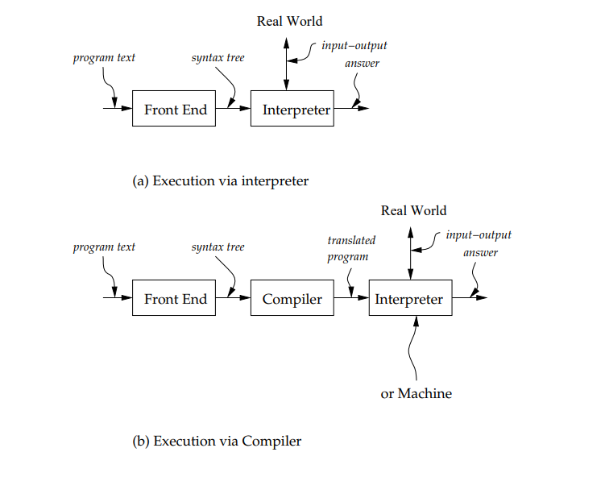

EOPL: Chapter 3: *Expressions*
========================

3.1: Specification and Implementation Strategy
----------------------------------------------

Our specification will consist of assertions of the form
|
    (value-of exp *ρ*) = val
|
meaning that the value of expression exp in environment *ρ* should be val.

In order to derive these assertions, we can use rules and equations by hand
to deterimine the intendended value of expressions such as the one above.

* definition: source language
* definition: implementation language
* definition: target language

.. insert some diagram

*More info on Target Languages!*
^^^^^^^^^^^^^^^^^^^^^^^^^^^^^^^^
    Often target languages are instead interpreted by
    a simpler language than the original target machine language
    making it simpler to write an interpreter.

    Some benefits to this is that the program can be compiled a single
    time and then run on many different hardware platforms without
    tedious dependency issues. 

    Historically, this type of target language is called **byte code** and its
    interpreter a **virtual machine**

Compiler Components
^^^^^^^^^^^^^^^^^^^
A Compiler is usually made up of two parts:

1. An **Analyzer**: Attempts to deduce useful info about a program
2. A **Translator**: Translates program, possibly using info from *Analyzer*

Regardless of implementation strategy, all interpretation *needs*:

A **Front End** to convert programs into **Abstract Syntax Trees**

- Given that whatever we are interpreting is *always* just strings of characters,
    a front end needs to be made of components that can make sense of this data by 
    **grouping them** into **meaningful units of information**.

- *The* **front end** *is typically made of* **2 stages**:

    1. *Scanner*
    2. *Parser* 

    

New heading
^^^^^^^^^^^